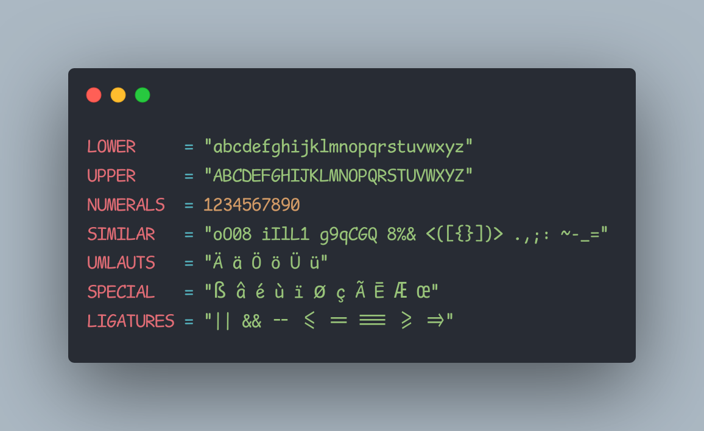

# Komisch Mono

> Comic Shanns v2 -> NerdFont Patcher -> Ligaturizer -> Komisch Mono

[Comic Shanns v2](https://github.com/shannpersand/comic-shanns) with
[ligatures](https://github.com/ToxicFrog/Ligaturizer), and most [Nerdfont symbols](https://github.com/ryanoasis/nerd-fonts/).

The font family is called `Komisch Mono`.

## Preview



## Build

> Requires Nix.

```sh
nix build
# Fonts are inside `./result`.
```

## License and Attributions

This project is released under the MIT license.
Check out the [LICENSE](LICENSE) file for more information.

- [Neo Comic Mono](https://github.com/jptrzy/neo-comic-mono-font) was used as reference for the nix file.
- [Comic Mono](https://github.com/dtinth/comic-mono-font) was used for the main font transformation
